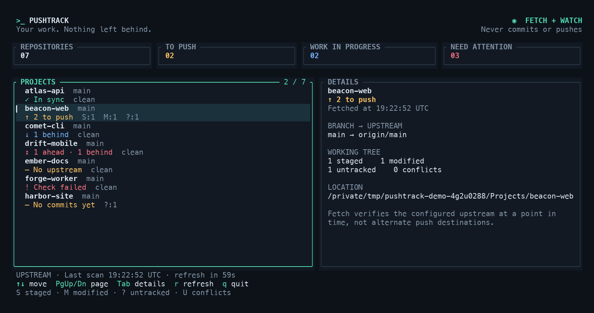

<p align="center">
  
</p>

<h1 align="center">PushTrack</h1>

<p align="center">Your work. Nothing left behind.</p>

A colorful **Rust + Ratatui** terminal dashboard for the question: **“Did I push it?”**

Track repositories across multiple folders, spot unpushed commits, and inspect uncommitted changes without leaving your terminal. Works independently of Pi, your editor, or any coding agent.

**PushTrack never commits, pushes, pulls, checks out, or resets anything.** Network access is opt-in with `--fetch`. All application messages are in English.

## The dashboard



*Actual terminal output using sample local repositories.*

```bash
pushtrack --fetch --watch
```

Watch mode opens a dedicated full-screen terminal interface instead of printing an ever-growing list:

- A dark, mint-accented layout with summary cards and color-coded Git states.
- A scrollable project list with a clearly highlighted selection.
- A details panel for the selected repository's branch, upstream, files, path, and errors.
- Background Git checks: keyboard navigation and quitting remain responsive during fetch.
- Side-by-side panels in wide terminals, stacked panels in narrower windows.
- Selection preserved across refreshes, including when the folder list changes.
- The previous terminal screen, cursor, and input settings restored on exit.

| Key | Action |
| --- | --- |
| `↑` / `↓` or `k` / `j` | Select a project; scroll when the details panel is focused |
| `Page Up` / `Page Down` | Move a page |
| `Home` / `End` | Jump to the first/last project or the top/bottom of details |
| `Tab` / `Shift+Tab` | Switch between projects and details |
| `r` | Refresh now; does not start overlapping scans |
| `q` | Quit |
| `Ctrl+C` | Exit and cancel an active Git operation |

At least **60 columns × 18 rows** is recommended. The dashboard is most comfortable at **110+ columns**. No separate GUI window is opened; it uses your terminal's alternate screen buffer.

## Install

Requirements:

- **Rust 1.88+** and Cargo, available through [rustup](https://rustup.rs/).
- **Git 2.40+** on `PATH`.
- A macOS or Linux terminal. The current release has been tested on macOS; Windows is not supported.

```bash
git clone https://github.com/TemelGunaydin/PushTrack.git
cd PushTrack
./scripts/install.sh
```

The installer uses `cargo install --locked` to build and install the executable at `~/.local/bin/pushtrack`. It requires no `sudo` and does not change your shell configuration.

If needed, add this line to `~/.zshrc` or your shell's configuration:

```bash
export PATH="$HOME/.local/bin:$PATH"
```

A custom installation prefix is supported:

```bash
PREFIX="$HOME/tools" ./scripts/install.sh
```

To run without installing:

```bash
cargo run --locked -- --help
cargo run --locked -- --fetch --watch
```

## Track any folders

Add individual repositories or parent folders containing projects:

```bash
pushtrack add ~/Projects ~/Work /Volumes/External/Repos
pushtrack list
```

Then check your saved folders from anywhere:

```bash
pushtrack                         # One-off local report
pushtrack --fetch                  # One-off report with upstream checks
pushtrack --watch                  # Interactive local dashboard
pushtrack --fetch --watch          # Interactive dashboard with upstream checks
```

Remove a folder without deleting its files:

```bash
pushtrack remove ~/Work
```

Explicit paths are scanned once without modifying your saved list:

```bash
pushtrack ~/SideProjects /path/to/another/repo --fetch
pushtrack "/path/with spaces/project" --watch
```

Without explicit paths, PushTrack uses saved folders. If none are saved, it scans the current directory. There is no hardcoded `~/Projects` default.

Folder settings are stored in `$XDG_CONFIG_HOME/pushtrack/config.json`, or `~/.config/pushtrack/config.json` when `XDG_CONFIG_HOME` is unset or not absolute. Writes are atomic; malformed configuration is reported rather than overwritten.

**Updating:** re-run the installer to replace an older executable. Existing saved-folder settings remain compatible and do not need conversion.

## Reading Git status

| Status | Meaning |
| --- | --- |
| Mint `✓ In sync` | Current branch and its upstream reference are equal |
| Amber `↑ … to push` | Local commits are ahead of the upstream reference |
| Blue `↓ … behind` | The branch is behind its upstream reference |
| Red `↕ … diverged` | Both sides have commits missing from the other |
| Amber `—` / `!` / `?` | No upstream, no commits, detached HEAD, or missing upstream ref |
| Red `! Check failed` | Git or remote verification failed; do not assume synchronization |

Working-tree counts are separate from branch status:

- `S`: staged files.
- `M`: modified but unstaged files.
- `?`: untracked files, excluding ignored files.
- `U`: merge conflicts.

Repositories with uncommitted files prominently show **`● N uncommitted`** in amber (red for conflicts), independently of their branch's push status. `In sync` only means the committed history matches the upstream; it does **not** mean the working tree is clean.

One file can contribute to both `S` and `M`, but is counted once in the uncommitted total. “Uncommitted” in the summary cards counts repositories with changes. “Need attention” includes uncommitted work, repository issues, and scan warnings; switch to Details to read warnings.

### Cached information is not remote verification

Without `--fetch`, PushTrack reads local metadata only. A cached `origin/main` can be stale: **a green local result does not prove the server is synchronized now**.

`--fetch` refreshes the current branch's configured upstream. A successful check shows its timestamp in UTC. Authentication errors, timeouts, unavailable remotes, and deleted upstream branches are never displayed as verified green results.

An upstream pointing to another local branch is labeled as local during fetch checks. Fetch verification reflects a point in time; someone else can change the remote afterward.

### Safety and scope

- Only the **current branch** is compared with its **configured upstream**. Other branches, tags, stashes, and alternate push destinations are not checked. `pushRemote`, `remote.pushDefault`, separate push URLs, and custom push refspecs may send commits somewhere else; that destination is not verified here.
- `--fetch` downloads Git objects and updates only the relevant remote-tracking ref. It does not modify local branches, the index, or working-tree files. Tag fetching, submodule recursion, and automatic maintenance are disabled. Custom refmaps cannot update extra refs.
- Without `--fetch`, no remotes are contacted. Optional index writes and filesystem-monitor hooks are disabled during status checks.
- Existing Git credentials, `core.sshCommand`, and SSH configuration are respected. Interactive credential prompts are disabled. Each Git subprocess has a **20-second timeout**; private repositories need working non-interactive authentication.
- Cancellation terminates the owned Git process group, including transport and credential helpers.
- PushTrack launches Git without a shell. Git itself may run configured hooks or helpers; only inspect repositories you trust.

## Discovery, refresh, and colors

Discovery searches each selected folder and up to **two directory levels below it**. It stops descending when it finds a repository. Add deeper or nested repositories explicitly. Ordinary repos and linked worktrees are supported; bare repositories are not listed.

Hidden directories and common dependency/build directories are skipped. Symlinked child directories are not followed, but explicit symlink paths are resolved. Overlapping roots are deduplicated. Missing folders produce warnings, not silent omissions.

Watch mode refreshes every **10 seconds**, or **60 seconds with `--fetch`**, measured after each scan finishes. It reloads saved folders each cycle, so `add` and `remove` can be used from another terminal. Refreshing uses the same fetch mode as the original command.

```bash
pushtrack --color always          # Force colors
pushtrack --color never           # Plain one-off output
pushtrack --watch --color never   # Monochrome TUI, still keyboard-driven
NO_COLOR=1 pushtrack              # Disable automatic colors
pushtrack > status.txt            # Plain text automatically
```

`--watch` requires interactive stdin and stdout and is not supported with pipes or `TERM=dumb`. One-off reports remain pipe-friendly. Explicit `--color always` overrides automatic detection. Monochrome watch mode still uses terminal control sequences for layout and selection.

For paths beginning with a dash or matching a command name:

```bash
pushtrack -- ./-project
pushtrack ./add
```

## Development and tests

```bash
cargo fmt --all --check
cargo clippy --all-targets -- -D warnings
cargo test --locked
cargo build --release --locked
```

Tests cover temporary local Git remotes, push/ahead/behind/diverged states, stale and deleted refs, fetch failures, worktree preservation, custom refmaps, conflicts, renames, worktrees, configuration compatibility, CLI output, keyboard selection, and bounded dashboard layouts.

The optional real-terminal acceptance suite uses Python, [uv](https://docs.astral.sh/uv/), and an isolated `pyte` dependency:

```bash
cargo build --release --locked
uv run --no-project --with pyte scripts/test_tui.py target/release/pushtrack
```

It checks alternate-screen behavior, arrows, paging, resize, detail scrolling, refresh, monochrome output, terminal restoration, and navigation/quit during a blocked fetch. Tests use temporary repositories and do not contact GitHub or modify your projects.

### Exit codes

- `0`: completed, or quit the dashboard with `q`. Pending commits are not execution errors.
- `1`: configuration, discovery, or Git/fetch failure; no repositories found; unavailable interactive terminal.
- `2`: invalid command-line syntax.
- `130`: interrupted with Ctrl+C/SIGINT.
- `143`: terminated with SIGTERM.

Watch mode continues after per-repository or configuration errors so the next refresh can retry.
